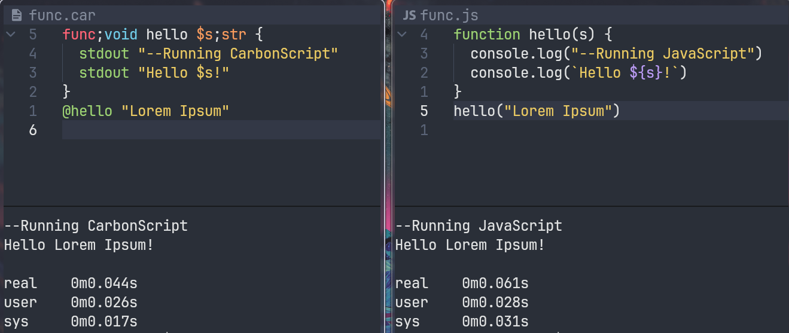

# CarbonScript

A lightweight, statically-typed programming language inspired by C, designed for simplicity, readability, and efficiency.

## 🚀 What is Carbon Script?

Carbon Script is a procedural programming language with a clean syntax and structured approach to variables, functions, and loops. It eliminates unnecessary complexity while retaining powerful built-in functions and C-like logic for easy adoption.

## 📦 Installation

> [!IMPORTANT]
> Make Sure Python3 version 3.10 or above is installed

```bash

git clone git@github.com:sjapanwala/carbonscript.git
cd carbonscript/
chmod +x install.sh && sudo ./install.sh

```

## ⏯️ Get Started Using CarbonScript

### Using The Live Interpretor

after installation type `car` into your terminal, and the live interpretor will be available to be used

type code there to execute them in real time.

> visit [Code Demo's](./demonstrations/) for more information on how to write code or [Programs](./programs/) to see example programs

### Interpreting Files

1. Create a file with the extention `.car`, this is the file that will be passed in
2. Write code in this file follow the [Synatx](./programs/syntax.car) to get started
3. After you are finished writing the code, run it in the terminal like so `car filename.car`

> [!IMPORTANT]
> For VIM/NVIM or VSCODE users. Download the syntax highlighting to help aid your carbonscripting journey!

> Syntax Installation For
> [VIM](./vim_syntax/)

> Syntax Installation For
> [VSCode](./carbon-vscode/)


## 📜 License 

CarbonScript is licensed under **MIT License**. Visit [License](./LICENSE) For More Details

## 🤺 Compare CarbonScript vs JavaScript (NodeJS)



> Running the same functions

> On Average CarbonScript was 0.285 Seconds Faster Than JavaScript (350 Iterations)

## 🏃 Lets Get Started!

```car

func;void main {
  stdout "Lets Get CarbonScripting Today!"
}
```

## 📝 Learn CarbonScript
  
  ### --- INDEX --- 
  1. [Topic 1. Hello World?](#topic-1-hello-world)
  2. [Topic 2. Reading From Terminal](#topic-2-reading-from-terminal)
  3. [Topic 3. Data Types](#topic-3-data-types)
  4. [Topic 4. Assigning Variables](#topic-4-assigning-variables)
  5. [Topic 5. Calling Variables](#topic-5-calling-variables)
  6. [Topic 6. Logic and Math](#topic-6-logic-and-math)
  7. [Topic 7. Control Flow](#topic-7-control-flow)
  8. [Topic 8. Loops](#topic-8-loops)
  9. [Topic 9. Writing Functions](#topic-9-writing-functions)
  10. [Topic 10. Calling Functions](#topic-10-calling-functions)

- ## Topic 1. Hello World?
  Lets begin with the basics, the most common first program written ever.

  In CarbonScript the keyword `stdout` is reserved for outputting to the terminal. `stdout` stands for `standard output`
  
  ```car
  stdout "Hello World"
  ```

  > This Will Output Hello World

- ## Topic 2. Reading From Terminal

  Similiar to `stdout` we have a keyword `stdin` which stands for `standard input` which is a keyword reserved for taking inputs from the terminal

  Taking inputs like so, will save it to a variable that can be accessed later on

  ```car
  stdin age;int "How Old Are You?"
  ```
  
  In the Codeblock above, we call the keyword `stdin` followed by the variable name `age` we then add a `;` and then the variable type followed by the prompt in quotes. (the prompt is always a string)

  > In CarbonScript all types are assigned by adding a semicolon then the type name after data
  
  So now the user will be asked in a prompt

  ```txt
  int How Old Are You?
  ```

  If an incorrect type is given, it will return an error, not saving anything to the variable

- ## Topic 3. Data Types

  CarbonScript has 5 Datatypes (01/28/25) being mostly similiar to other langauges

  | DataType  | Example                 |
  |---------- | ----------------------- |
  | `int`     | Intigers                |
  | `str`     | Strings                 |
  | `flt`     | Floating Point Numbers  |
  | `arr`     | Arrays                  | 
  | `bool`    | Boolean (T/F = 1/0)     |
  | `void`    | No Value                |
  
  each data type has its own attributes. If a data type is not assigned properly, it will have difficulty interacting with other variables and functions

- ## Topic 4. Assigning Variables

  We covered a little bit on how to save variables with the `stdin` function, but thats the tip of the iceberg

  In CarbonScript we have 3 ways to assign variables. each with thier own 'quirk'
  1. `let`
  2. `set`
  3. `const`

  ### Using `let`
  
  let is used to define a variable that is not yet defined or will be defined in the future. holds the place for it to be used later on.
  
  let is mutable, but once let is defined it will only be able to take the type it was initially assigned, until its changed by a different assignment keyword

  ```car
  let name;str
  let age;int
  let isMale;bool
  ```
  
  ### Using `set`

  set is used to define a variable. 

  since set is mutable, we can use set to change variables and make new variabless

  ```car
  set name = "John Doe";str
  set age = 50;int
  set isMale = 1;bool
  ```

  ### Using `const`

  const is used to define a variable.

  const is **Immutable**; a value defined with const cannot be changed during runtime, has to be changed in a new instance

  ```car
  const name = "John Doe";str
  const age = 50;int
  const isMale = 1;bool
- ## Topic 5. Calling Variables

  Variables are called with the prefix `?` followed by the name of the variable

  ```car
  const x = "Greetings!";str
  stdout ?x

  // Output
  >> Greetings!
  ```

  along side the variables you define, there are also lots of `predefined variables` available. you can view all the variables defined with the keyword `varlist`. this will show you a table like so

  ```txt
  Variable      IsModify    Type        Value
  ________      ______      ____        _____
  errorlevel    True        int         0
  ...
  x             False        str         Greetings!
  ```

- ## Topic 6. Arrays

  setting arrays is pretty simple in CarbonScript
  
  arrays can be set with a bunch of different ways, using `set`,`const`,`let`

  array contents are seperated using `,` (commas)

  ```car
  set a = 1,"CarbonScript";arr
  // output
  // [1,"CarbonScript"]
  ```

  ### Push
  to append to an array, we use `push` which appends the item(s) to the end of the array
  
  ```car
  push a 5 10
  // new form of ?a
  //[1,"CarbonScript",5,10]
  ```

  ### Pop
  to read the elements of the array, we use `pop` which "pops" the last element of the array

  stores the element popped into a special variable called `?pop`

  ```car
  pop a
  // new form of ?a
  // [1,"CarbonScript",5]

  stdout ?pop
  // 10
  ```


- ## Topic 6. Logic and Math

  all logical operators are the same as any other operators.

  True and False values are similar to ints, but are typed as booleans (True = 1, False = 0).
   Access True and False with the keywords `?true` or `?false`

  Logical Statements are to be types within parenthesis padded by white space.

  ```car
  const x = ( 1 + 1 )   // types arent required unless your assigning a constant value yourself
  const y = ( ?x * 10 )
  ```

- ## Topic 7. Control Flow
  
  In CarbonScript, we have access to if else statements, but they are a little different.

  | Global Name | CarbonScript Name |
  | ----------- | ----------------- |
  | if          | `fi`              |
  | else if     | `elsefi`          |
  | else        | `default`         |
  
  while they have different keywords, they operate the same way

  ```car
  const x = 10;int

  fi ( ?x == 50 ) stdout "X is the same value as 50"
  elsefi ( ?x < 50 ) stdout "X is smaller than 50"
  default stdout "X is Greater than 50"

  // Output
  >> X is smaller than 50
  ```

- ## Topic 8. Loops

  As of Update 1.2/25, we have 2 loops `repeat` and `do`

  ### `repeat loop`
  - similiar to for loops
  - 'repeats' over a given number of iterations
  - `?iteration` can be used to check the iteration number

  ```car
  repeat 5 {
    stdout This Is Iteration Number ?iteration
  }

  // Output
  >> This Is Iteration Number 0
  >> This Is Iteration Number 1
  >> This Is Iteration Number 2
  >> This Is Iteration Number 3
  >> This Is Iteration Number 4
  ```

  ### `do loop`
  - similiar to a while loop
  - repeats until a conditional to b
  - `?iteration` can beb used to check the iteration number

  ```car
  do 0 < 5 {
    stdout This Is Iteration Number ?iteration
  }

  // Output
  >> This Is Iteration Number 0
  >> This Is Iteration Number 1
  >> This Is Iteration Number 2
  >> This Is Iteration Number 3
  >> This Is Iteration Number 4
  ```

  ### Incrementation And Decrementation
  Even though CarbonScript iterates loops on its own, we have `increm` and `decrem` which are similiar to `i++` and `i--` respectively

  ```car
  set x = 10;int
  set y = 15;int

  increm ?x ?y

  stdout ?x ?y

  decrem ?x ?y

  stdout ?x ?y

  // Output
  >> 11 16
  >> 10 15
  ```
- ## Topic 9. Writing Functions

  Functions are written with the keyword `func`, they expect a data type they will return, the name of the function followed by the variables passed in. variables inside these functions use `$` instead of `?`

  lets write a simple function to greet!

  ```car
  func;void greet $name;str {
    stdout Hello $name !
  }
  ```

  since the function above doesnt need a return value, we labeled it as `void` meaning nothing / null. but for other function types, return values are required

  lets write a function that squares a number
  ```car
  func;int squared $x;int {
    set ans = ( $x * $x )
    return ?ans
  }
  ```

  a variable is not often required. sometimes writing a `main` function can help with code organization, in those scenarios since we dont want to input or return anything, we can label all those feilds as `void`. sometimes we want to manage by `errorcodes` so we may choose to return a errorcode similiar to how C returns an `int` error code

  ```car
  // Sample Main Functions

  func;void main {
    // returning nothing
  }

  func;int main {
    // returning a code
    return 0
  }

  func;void main $void {
    // returning nothing, but using void to show no variables are used
  }
  ```

- ## Topic 10. Calling Functions
  
  Since we have learnt how to define functions, lets learn how to call them!

  the `@` keyword is reserved for calling functions. followed by the name of the function

  function arguements can be paresed by adding them in the respected sequence they were defined in the function header

  ```func
  // *refer back to previous topic for function source code*

  @greet "John Doe"

  >> Hello John Doe
  ```

  since this was returning `void` we dont need to store the information, but for functions that return, we need to store them in a variable or print them out, or else they will be used as another command

  ```
  // *refer back to previous topic for function source code

  const result = @squared 5

  stdout ?result

  >> 25
  ```

  ## Conclusion
  ### CarbonScript is a versatile and simple programming language designed for clarity. It is suitable for both beginners and experienced developers who want to write clean and concise code. Whether you're building a small script or a larger program, CarbonScript provides the necessary tools and functionality to get the job done.

  ### Happy Hacking!
