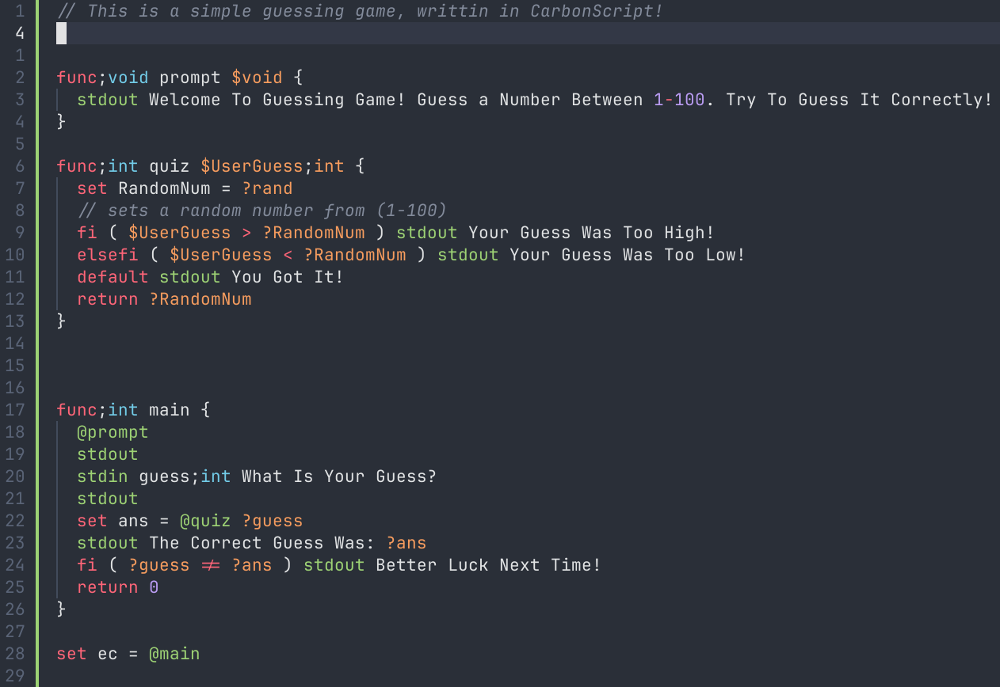

# Welcome To "Learning CarbonScript"

## Introduction
- CarbonScript is a toy scripting language developed by Saaim Japanwala as a neat fun little project
- built as an interpretor, by no means is it a useful language, take it as 'something built to fuel dumbassery'

You can either follow along in this Markdown file, or look through the [`demonstrations`](./demonstrations/) or the [`programs`](./programs/)

## Basic Concepts

### Variables

In CarbonScript, variables can be declared in `3` ways, each serving a different purpose.

`set`: creates a mutable variable that can be changed during runtime
```car
set x = 10;int
```

`const`: creats an immutable variable that **cannot** be changed during runtime
```car
const y = 20;int
```

`let`: declares a temporary mutable variable with no initial value

```
let z;int
```

### Accessing Variables

to access a variable thats been defined, you can use the `?` symbol followed by the variable name

```car
stdout The Value of X is ?x     // this will print 10
stdout The Value of Y is ?y     // this will print 20
stdout The Value of C is ?c     // this will print 'Undefined'
```

### Predefined Variables

there are already some predefined variables that are used in system running, or for your aid. Type `varlist` to view them

## Data Types

CarbonScript supports several commonly found data types

`int`:  A whole number intiger

`flt`:  A floating point number 

`str`:  A string / chars

`bool`: Boolean Values (True/False)

`void`: No Value

Since CarbonScript is *on the verge* of being *fully* statically typed, you can define a data-type to what ever variable / function / etc...

## Incrementing And Decrementing

In CarbonScript, the `increm` and `decrem` operators are used to increment and decrement a variable.

You can `increm` or `decrem` a more than one variable in one line

```car
set x = 10;int
decrem ?x 
```

## Standard I/O

### Taking Inputs

inputs are taken in with the keyword `stdin` and stored in a variable defined by the user, the definition has to follow these rules

```txt
stdin {variable_name};{datatype} {Console Prompt}
```

For Example, asking for a users name and age

```car
stdin name;str Whats Your Name?
stdin age;int Whats Your Age?
```

This will be prompted as...

```txt
str Whats Your Name?
int Whats Your Age?
```

### Sending Outputs

To output to the console, we use the keyword `stdout`, this will output all contents. no need for quotes, as this aggregates all text dividing by whitespace

```car
stdout Hello ?name
stdout You are ?age Years Old
```

## Conditional Statements

CarbonScript provides ways to respond conditionally

`fi` statements are the same as `if statements`:
```car
fi ( ?x > 10 ) stdout x is greater than 10
```

`elsefi` statements are the same as `if else` statements:
```car
elsefi ( ?x < 5 ) stdout x is less than 5
```

`default` statements are the same as `else` statements
```car
default stdout x is between 5 and 10
```

Example Program
```car
set x = 7;int
fi ( ?x > 10 ) stdout x is greater than 10
fielse ( ?x < 5 ) stdout x is less than 5
default stdout x is between 5 and 10
```

## Loops

currently, the only loop available is the `repeat` and `do` loop. which is equivalent to `for loop` which iterates throught a number, a range of a number. and a while loop

the `?iteration` variable is reserved to be the enumeration value of the loop

```car
repeat 5 {
  stdout ?iteration
}
```

this will print out every number from 0-4 inclusive

```car
do 0 < 5 {
  stdout This Will Repeat 5 Times
  // do loops will automatically increment
}

```

## Incrementations

### Increm

`increm` is the same as if we had `i++`

```car
set x = 1;int
increm ?x
stdout ?x     // will print 2
```

`decrem` is the same as if we had `i--`

```car
set x = 1;int
decrem ?x
stdout ?x     // will print 0
```

## Functions

### Declaring Functions

functions are declared with the `func` keyword, they follow a strict formatting guideline

```txt
func;{return_type} {function_name} {variables} {
    // code
    ...if a return type is anything but void, then a return statement is required
}

lets make a simple addition function, which adds two numbers

```car
func;int addition $x;int $y;int {
    const result = ( $x + $y )
}

set ans = @addition 2 2
```

since we are returning a value, we need to store it in a value

Usually writing a main function is a good idea...

```car
func;int main {
  //code
  return 0
}

```

# End

 
